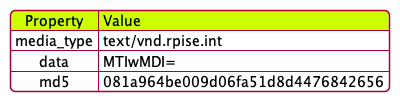

## Tavta 0.1

The fundamental unit of storage in the persistence store for stack is **Tatva**

For instance, Integer Value 12002 is stored as follows.

**Tatva** will store the data in **Base64** Encoding format. [The MIME type](https://www.w3.org/2002/12/cal/rfc2425.html) will denote the type of data Tatva carries.
Tatva will also carry an MD5 hash value.
